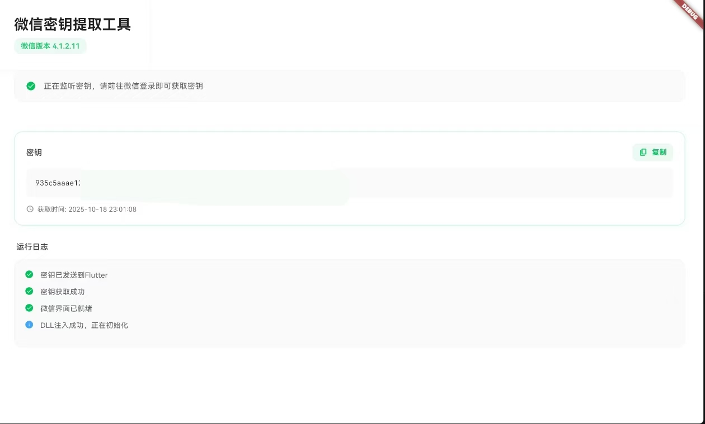

<div align="center">

# 微信数据库与图片密钥提取工具

在微信 4.0 及以上版本中获取数据库内容与缓存图片解密密钥的工具  
Tool for obtaining WeChat database and decrypting cache image keys

[](LICENSE)
[](https://www.microsoft.com/windows)
[](https://github.com/ycccccccy/wx_key/stargazers)
[](https://github.com/ycccccccy/wx_key/network/members)

<p align="center">
  
</p>

</div>

 **重要声明**：本项目仅供技术研究和学习使用，严禁用于任何恶意或非法目的。  
 
 如果这个项目对你有帮助，请给我一个 Star ❤️

---

## 项目简介

本项目面向微信 4.0 及以上版本，用于：

获取微信数据库密钥和提取缓存图片的解密密钥


## 小小小提示

如果你对本项目感兴趣，也可以看看我的另一个项目：  
[EchoTrace - 微信聊天记录导出与分析，年度报告应用](https://github.com/ycccccccy/echotrace)


## 关于支持版本的说明

支持所有微信 4.x 版本  
- 已实际测试版本：
  - 4.1.5.11
  - 4.1.4.17
  - 4.1.4.15
  - 4.1.2.18
  - 4.1.2.17
  - 4.1.0.30
  - 4.0.5.17


## 快速开始

1. **下载发布版本**
   - 前往 [Releases](https://github.com/ycccccccy/wx_key/releases) 页面，下载最新的压缩包 `app.zip`。
2. **运行工具**
   - 解压后运行其中的 `wx_key.exe`，或运行你自行编译得到的可执行文件。

>  **注意**：请不要把工具文件夹放在任何包含中文字符的目录下，否则可能导致 DLL 加载失败等问题。

### 图片密钥获取建议流程

1. 打开微信并完成登录（登录后尽快执行后续步骤）
2. 进入朋友圈，点开一张**之前没有点开过**的图片，以触发新的缓存
3. 回到本工具，执行 “获取图片密钥”


## 目录结构概览

```text
wx_key/
├── lib/                                  # Flutter 前端
│   ├── main.dart                         # UI 与状态管理
│   ├── services/
│   │   ├── remote_hook_controller.dart   # FFI 控制器，轮询 DLL
│   │   ├── dll_injector.dart             # WeChat 启动/进程控制
│   │   ├── key_storage.dart              # 密钥持久化
│   │   ├── image_key_service.dart        # 图片密钥提取
│   │   └── app_logger.dart / log_reader.dart
│   └── widgets/                          # 自定义组件
├── assets/dll/wx_key.dll                 # 控制器 DLL
├── wx_key/                               # C++ 原生项目（Visual Studio）
│   ├── include/                          # Hook、IPC、Shellcode 头文件
│   ├── src/                              # hook_controller、remote_scanner 等实现
│   └── wx_key.vcxproj                    # 工程配置
└── build/windows/...                     # Flutter 构建产物
```


## DLL 扩展使用

如果你希望在自定义程序中直接复用 `wx_key.dll`（例如：

- 自行获取 WeChat 进程 PID  
- 调用 DLL 导出函数以获取密钥

参考文档：[`docs/dll_usage.md`](docs/dll_usage.md)，里面包含：

- DLL 导出接口说明
- 调用示例
- 常见注意事项与错误排查


## 开发构建

如果你希望自行编译项目，可以按照以下步骤：

```bash
# 1. 克隆项目
git clone https://github.com/ycccccccy/wx_key.git
cd wx_key

# 2. 安装依赖
flutter pub get

# 3. 构建发布版本（Windows）
flutter build windows --release

# 4. 可执行文件位置
# build/windows/runner/Release/wx_key.exe
```


## 许可证与免责声明

### 许可证

本项目采用 **MIT License**，详见 [LICENSE](LICENSE) 文件。  
你可以自由使用、修改和分发本软件，但需要保留原有版权声明和许可证文本。

### 免责声明

> **重要提醒**：本工具仅用于技术研究和学习目的。

- 使用本工具产生的一切后果与责任，均由使用者自行承担  
- 开发者不对因使用本工具而导致的任何损失负责  
- 使用者必须确保其行为符合当地法律法规  
- 严禁将本工具用于任何商业或恶意用途


## 贡献指南

欢迎通过 Issue / Pull Request 来改进本项目：

1. Fork 本仓库
2. 创建分支：`git checkout -b feature/YourFeature`
3. 提交更改：`git commit -m "Add YourFeature"`
4. 推送分支：`git push origin feature/YourFeature`
5. 发起 Pull Request 并附上说明


## 致谢

感谢以下项目提供启发与思路：

- [WxDatDecrypt](https://github.com/recarto404/WxDatDecrypt) — 提供了关键的 imagekey 获取思路


## Star History

[](https://www.star-history.com/#ycccccccy/wx_key&type=date&legend=top-left)

---

<div align="center">

**请负责任地使用本工具，遵守相关法律法规**  
Made for educational purposes ❤️

</div>

