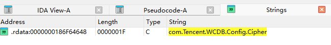
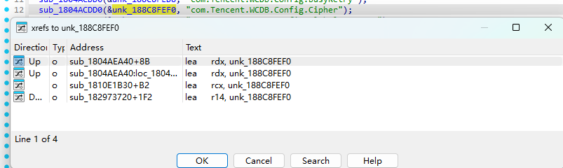
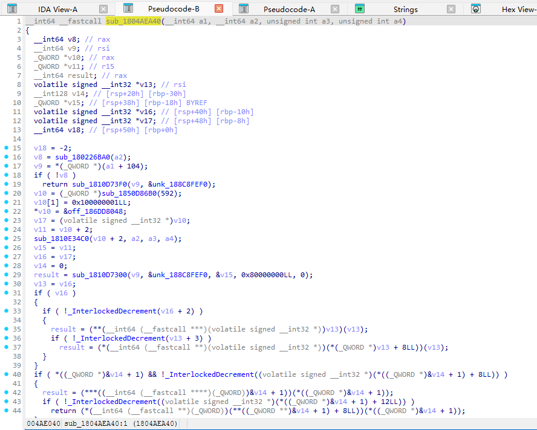
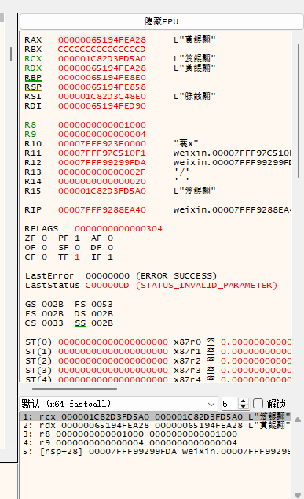
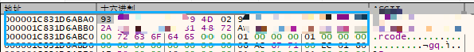

# 微信4.1key分析

## 第一阶段：IDA静态分析

### 1.1 问题起点
在新版4.1中，传统的基于固定内存特征或暴力内存搜索密钥的方法已经全部失效，证明微信的安全机制有了变化，密钥的存储位置或加载方式发生了变化（相关讨论见：https://github.com/sjzar/chatlog/issues/197）

### 1.2 寻找起点
在新版本中盲目地在内存中寻找32字节的数据无异于大海捞针。正确的思路是找到**处理**这段数据的**函数**。根据信息，微信数据库(WCDB)基于SQLCipher，其设置密钥的函数名为 `setCipherKey`，这个函数必然会生成最终需要的密钥

### 1.3 定位关键函数
1.  **线索**：在IDA中加载核心模块 `Weixin.dll`，搜索 `setCipherKey` 函数体中一个极具辨识度的字符串常量：`"com.Tencent.WCDB.Config.Cipher"`。

    

2.  **初步定位**：我们成功在 `.rdata` 段找到了这个字符串，并查看其交叉引用。

    

3.  **寻找调用**：通过追踪存储这个字符串的**全局变量**的交叉引用，我们最终找到了唯一的、真正**使用**这个变量的函数：`sub_1804AEA40`。

4.  **确认目标**：通过F5查看其伪代码，其逻辑与 `setCipherKey` 的源码高度吻合。

    

**成果**：我们成功确定了目标函数的**相对虚拟地址 (RVA)**: **`0x4AEA40`**

---

## 第二阶段：去x64dbg中手动验证

在投入自动化前，必须手动验证我们的静态分析结果是否正确。

1.  **设置断点**：启动微信并附加x64dbg。通过 `模块基地址 + 0x4AEA40` 计算出绝对地址，并设置一个软件断点。

2.  **触发与分析**：
    *   手机扫码登录，x64dbg命中了我们的断点！

    *   根据x64函数调用约定，我们观察**RDX寄存器**，它指向一个结构体。

        

    *   根据结构，我们查看内存地址 `[rdx+8]`，它指向密钥的缓冲区。我们成功在内存中看到了明文的32字节密钥。

        

**结论**：我们确认了4.1.1.19版本中的key相关函数地址，也再次拿到了新的密钥

---